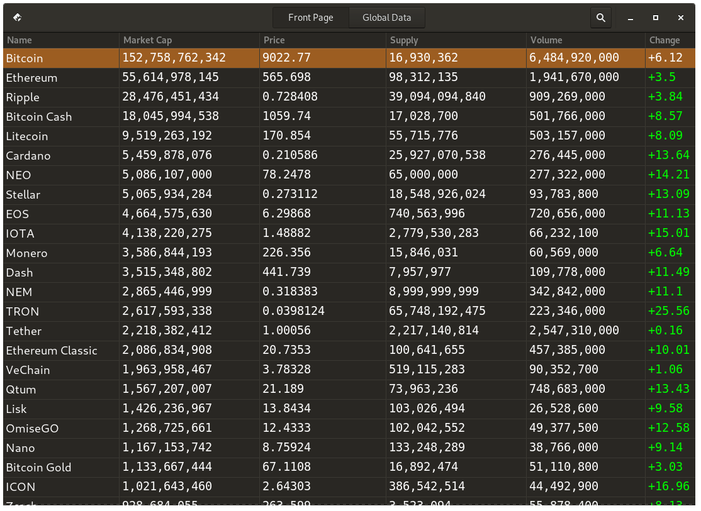
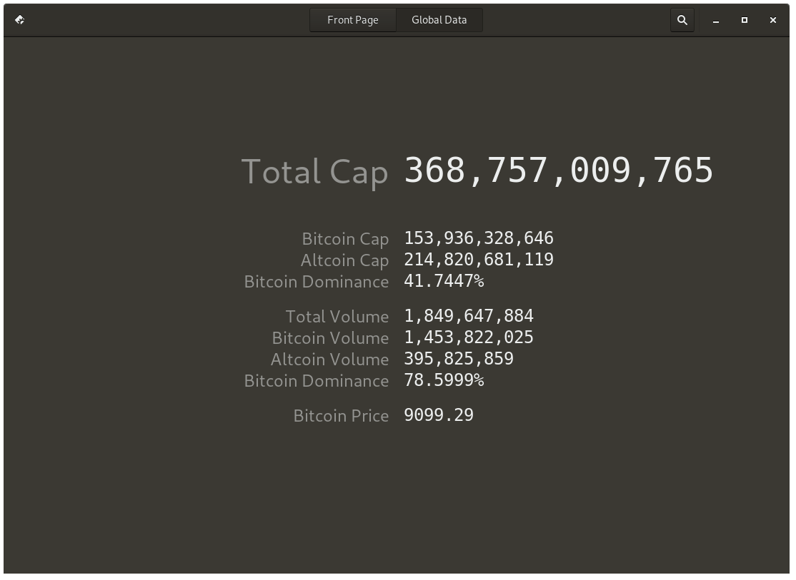

# Crypto - A cryptocurrency watcher made with GTK+3

Migrated to GitLab ([https://gitlab.com/ErikWallstrom/Crypto](https://gitlab.com/ErikWallstrom/Crypto))

Crypto uses the CoinCap.io API to fetch up-to-date data about cryptocurrencies.

## Screenshots




## Requirements

* gcc
* make
* gtk3
* json-glib
* libcurl

**Arch Linux (and derivatives)**

```bash
sudo pacman -S gcc make gtk3 json-glib libcurl
```

**Ubuntu (and derivatives)**

```bash
sudo apt install gcc make libgtk-3-dev libjson-glib-dev libcurl4-openssl-dev 
```

Currently requires network connection to start correctly

## Installation

```bash
git clone https://github.com/ErikWallstrom/Crypto.git
cd Crypto
make
sudo make install
```

## Planned features

* Portfolio
* Warnings/notifications

## License


